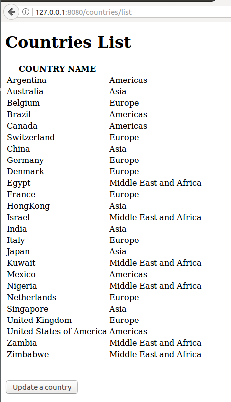

# Report - Distributed Application

## Part 1 - Intro

First thing was to create a project with every dependencies using the different tutorials we already made (JPA, MySQL, REST API, web services etc.).

## Part 2 - JPA data model

I first created the JPA model using an already existing database. To do this I used the IDE's integrated tools witch are using a MySQL connection to create the corresponding entities in the application.

### Question 1 :

We could expect that the JPA tools would create 7 PROJOs as we have 7 tables in the database, but 8 java classes were generated : one per table and one extra for job_history named ***jobHistoryPK.java***. Indeed PK stands for primary key and job history have two elements in its primary key witch explains that it needs an extra table to store the primary keys of job_histories so that a job_history occurrence have an end_date, a job_id and a department ID and simply a **job_historyPK as a primary key**.

### Question 2 :

Once the JPA model was generated, I created a simple repository for the country entity. It is the class named **countryRepository.java** in my project so that we can execute a simple GET request :

```java
@RepositoryRestResource(collectionResourceRel = "country", path = "country")
public interface CountryRepository extends PagingAndSortingRepository<Country, Long> {

	List<Country> findByCountryName(@Param("name") String name);

}
```
> We can notice that a repository is normally only used to get the data from the database to the application, but here the method **findByCountryName** is already created by the repo and returns exactly what we want so **we do not have the create a controller** yet.

Here is a quick view of the request using insomnia :


Once I could execute a POST de get the countries list, I saw where the stack overflow was [todo]

get employee get job history

update -> generé foreign key = err

### Question 3 :

I simply used the MySQL workbench to create a backup of the initial database. Using the export function we can generate a SQL script witch will allow us the re-create the database if we make ant mistake on it.

To ensure the backup was fully functional I tried to drop the database and to create it with the SQL script and everything was working fine, so I could start to modify the application to modify the database.

> We get something similar to what was provided on mootse for the databse.

### Question 4 :

First, as we wasn't modifying the database, the hibernate dll-auto property could be *none*. Here was what the application.properties looked like :
```java
spring.jpa.hibernate.ddl-auto=none
spring.datasource.url=jdbc:mysql://localhost:3306/humanresources
spring.datasource.username=root
spring.datasource.password=tseinfo
```
If we change the first property from **none** to **update**, then the application do not compile anymore.

Indeed, id we look at the **employee table**, we can see that one of the employees have a departmentID witch is equal to zero **whereas zero do no correspond to any primary key in the department table**.

Here is the error that we get :
[TODO]

To make things easier, I simply removed this occurrence.

### Question 5 :

In order to create a web service, I chose to use only one **_@Controller_** to handle the request mapping, and one **_@Repository_** to access data in the data base in order to have a code as simple as possible.

_JobRepository_ :
> Implicitly know methods like findOne(), findAll(), save(), but we will have to add extra methods declaration later.

```java
@Repository
public interface JobRepository extends CrudRepository<Job, String> {

}
```

_JobController_ :
> This code is simplified to be readable, in the real code I test if the job exists and return **http status**.

```java
@RestController
@RequestMapping("/job")
public class JobController {

	@Autowired
	private JobRepository jobRepository;

	@RequestMapping(value = "/update", method = RequestMethod.PUT)
	public ResponseEntity<Void> updateJob(@RequestBody Job job) {

		jobRepository.save(job);
		}
	}
}
```

Let's try this new web controller with a PUT request in insomia :




And we can verify that the modification is in the database :
[JobUpdateSQL]

> If we try to modify a job witch does not exists we have an error instead of the http status 200 OK.

> If we try to execute another methode than PUT we have this error message :
```json
{
	"timestamp": 1514580093427,
	"status": 405,
	"error": "Method Not Allowed",
	"exception": "org.springframework.web.HttpRequestMethodNotSupportedException",
	"message": "Request method 'GET' not supported",
	"path": "/job/update"
}
```

### Question 6 :

Now let's document our application using **swagger**.

The first thing to do with swagger was to import the maven dependencies.
>The proxy configuration was needed to import this artifact without any proxy.

Then I needed to create a class that I named **SwaggerConfig** to enable and configure Swagger :
```java
@Configuration
@EnableSwagger2
public class SwaggerConfig {
    @Bean
    public Docket productApi() {
        return new Docket(DocumentationType.SWAGGER_2)
                .select()
                .apis(RequestHandlerSelectors.basePackage("controllers"))
                .paths(regex("/job.*"))
                .build()
        		.apiInfo(metaData());

    }
    private ApiInfo metaData() {
        ApiInfo apiInfo = new ApiInfo(
                "Spring Boot REST API",
                "Spring Boot REST API for Online Store",
                "1.0",
                "Terms of service",
                new Contact("Hugo Gybels", "http://gybels.tk", "hugo.gybels@telecom-st-etienne.fr"),
               "Apache License Version 2.0",
                "https://www.apache.org/licenses/LICENSE-2.0");
        return apiInfo;
    }
}
```

Then the only thing to do is to add the following line before every RequestMapping :
```java
@ApiOperation(value = "<DESCRIPTION>", response = ResponseEntity.class)
```

Witch gives for the moment :

[SwaggerSample]

### Question 7 :

To have a more complete example of what we can do, we will now create another web service witch returns every jobs with a minimum salary above 9000.

To do so I had to had a RequestMapping in the JobController using the auto generated method **_findByMinSalaryGreaterThanOrderByMaxSalaryDesc_** :

```java
@ApiOperation(value = "Get jobs with a salary above the given value", response = ResponseEntity.class)
@RequestMapping(value = "/getAbove/{min}", method = RequestMethod.GET, produces = "application/json")
	public List<Job> getAbove(@PathVariable("min") BigDecimal min) {
		log.info("/job/getAbove");

		List<Job> returnedJobs = jobRepository.findByMinSalaryGreaterThanOrderByMaxSalaryDesc(min);

		return returnedJobs;
	}
```

It's also necessary to update the repository :
```java
@Repository
public interface JobRepository extends CrudRepository<Job, String> {
	List<Country> findByCountryName(@Param("name") String name);
}
```

And here is what we get with min=9000 :

[GetAbove9000]

### Question 8 :

Now we want to create a **Data Transert Object** for the entity employee using **ModelMapper**.

To do so, I first created a class named **EmployeeDTO** containing only the fields that we want :

```java
public class EmployeeDTO {

	private String firstName;
	private String lastName;
	private String departmentName;

	// Getters Setters
}
```

Then I created exactly like previously an **EmployeeController** and an **EmployeeRepository**. I created in the Controller a fonction named convertToDTO to convert an employee in an Employee DTO using ModelMapper :

_EmployeeController_
```java
@RestController
public class EmployeeController {

	@Autowired
	private EmployeeRepository employeeRepository;

	@Autowired
    private ModelMapper modelMapper;

	private EmployeeDTO convertToDTO(Employee emp) {
		EmployeeDTO employDTO = modelMapper.map(emp, EmployeeDTO.class);
		employDTO.setFirstName(emp.getFirstName());
		employDTO.setLastName(emp.getLastName());
		employDTO.setDepartmentName(emp.getDepartment().getDepartmentName());
		return employDTO;
	}

	@ApiOperation(value = "Lists all the Employees DTO",...)
	@RequestMapping(value = "/employeedto",...)
	public List<EmployeeDTO> getAllEmpDTO() {

		List<EmployeeDTO> listEmpDto = new ArrayList<EmployeeDTO>();

		Iterable<Employee> listEmp = employeeRepository.findAll();

		listEmp.forEach(emp -> listEmpDto.add(convertToDTO(emp)));

		return listEmpDto;
	}
}
```

And here is the result that we get :

[EmployeeDTO]

## Part IV - Web Interface

### Question 9 :

Once the maven dependencies were added, I created a CountryController witch will allow me to interact with a template named **countries.html** using **thymeleaf**.

There is a lot to say about Thymeleaf, but for now, the most important is to understand that we use a **Model** in witch we will add an attribute containing all of our countries :
```java
@RequestMapping(value = "/list")
public String getAllCountries(Model model) {

	model.addAttribute("CountryList", countryRepository.findAll());

	return "countries";
  //Will open /ressources/templates/countries.html in the browser
}
```

Once that we are in the html file, we can use Thymeleaf to display each element of this model using **th:each** :

```html
<tr th:each="Country : ${CountryList}">
  <td th:text="${Country.countryName}"></td>
  <td th:text="${Country.region.regionName}"></td>
</tr>
```

Witch gives us for _/countries/list_ :
[countriesList]

### Question 10 :

Still using Thymeleaf, we now want to be able dto update a country. To do so I had several mapping to do. First was when we click on "Update a country", we then make a _GET_ on /coutries/update where we will be able to select the ID of the country we want to modify, using the same method as previously and a bit of JavaScript to make the next GET once the country is selected :

```html
<form th:action="@{/countries/update}" methode="get">
	Country ID :<br/>
	<select name="countryIds" id="countryIds">
		<option  th:each="Country : ${CountryList}">
      <span th:text="${Country.countryId}"></span>
    </option>
	</select><br/>
</form>

<p><button value="Submit" id="subButton">Suivant</button></p>

<script>
document.getElementById("subButton").onclick = function() {
  var e = document.getElementById("countryIds");
  window.location.href = window.location.href + "/" + e.options[e.selectedIndex].value;
}
</script>
```

Here is what we optain :

[CountrySelection]

Now if we click on "suivant" we will pass the country ID in the GET parameters, to do so I had to use the **PathVariable** :
```Java
@GetMapping("/update/{countryId}")
public String updateForm(@PathVariable("countryId") String countryId, Model model) {
  model.addAttribute("country", countryRepository.findOne(countryId));
  return "countryUpdateForm";
}
```

Once the model was filed I could auto complete the form witch can now be modified :

[UpdateForm]

This form will send a POST with every parameters that we will use in the repository to update the database :

[updated]

> Note : I had to make the differnce on the same mapping on a GET and a POST using **@GetMapping** and **@PostMapping**.

```Java
@PostMapping("/update")
public String updateCountrySubmit(@ModelAttribute Country country) {
	Country existingCountry = countryRepository.findOne(country.getCountryId());
	existingCountry.setCountryName(country.getCountryName());
	existingCountry.getRegion().setRegionName(country.getRegion().getRegionName());
	countryRepository.save(existingCountry);
	return "countryUpdated";
}
```

### Question 10

To add some bootstrap and css, I had to create a folder **ressources/public/{css,js,img}**.
